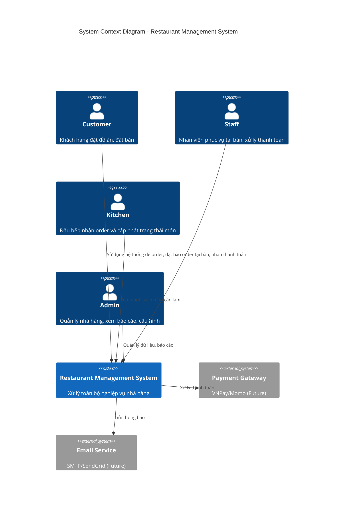
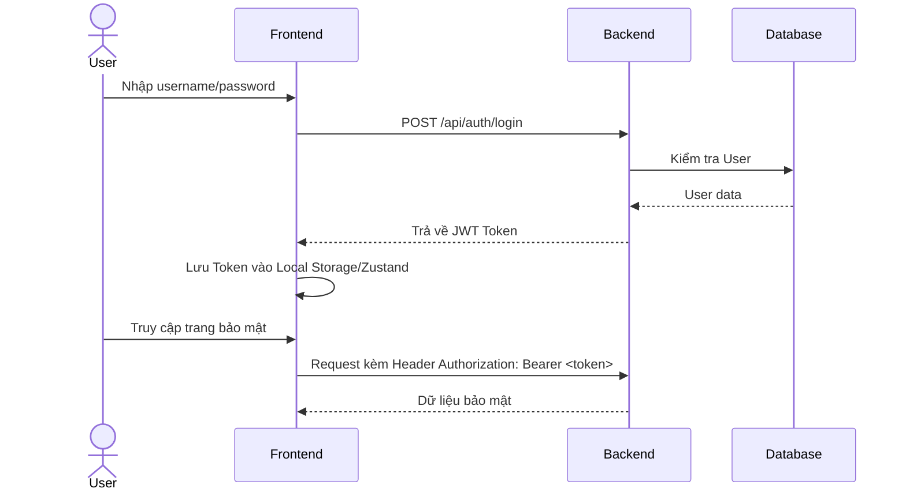
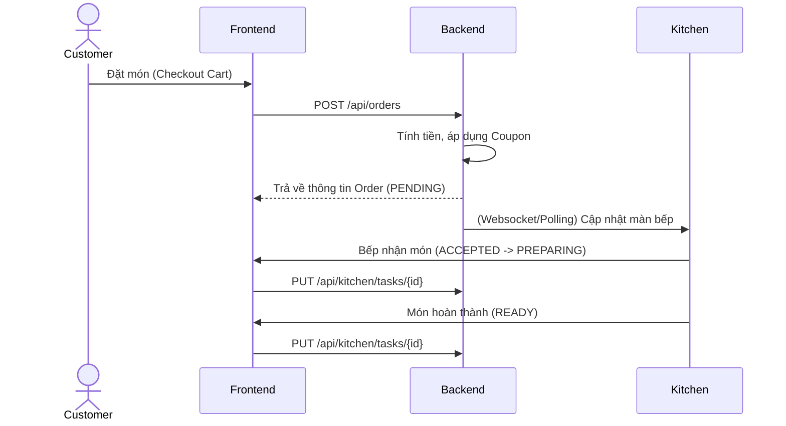
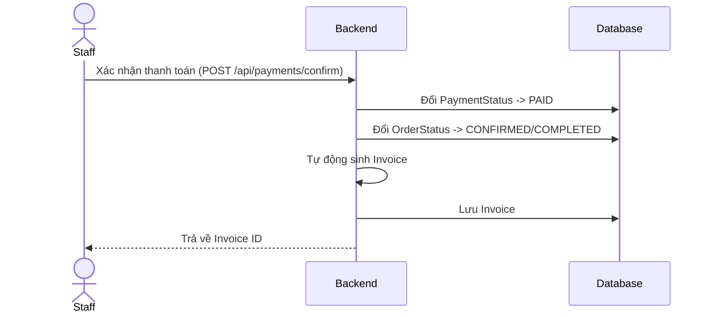

# System Architecture

## 1. Context Diagram
Hệ thống Restaurant Management System phục vụ nhiều đối tượng người dùng: Customer, Staff, Kitchen, Admin. Hệ thống bao gồm Frontend (Web App), Backend (REST API), và Cơ sở dữ liệu (MySQL). Trong tương lai, hệ thống có thể mở rộng tích hợp với các dịch vụ thanh toán (Payment Gateway), dịch vụ gửi Email/SMS.



## 2. High-Level Architecture
Hệ thống áp dụng kiến trúc Client-Server.

```mermaid
graph TD
    subgraph Frontend Layer
        Web[React SPA (Customer/Staff/Kitchen/Admin)]
    end

    subgraph API Gateway / Load Balancer
        Nginx[Nginx / API Gateway]
    end

    subgraph Backend Layer
        App[Spring Boot REST API]
        Security[Spring Security + JWT]
        Business[Service Layer]
        Data[Data Access Layer - JPA]
    end

    subgraph Storage Layer
        DB[(MySQL Database)]
    end

    Web -->|HTTP/REST| Nginx
    Nginx -->|Proxy| App
    App --> Security
    Security --> Business
    Business --> Data
    Data --> DB
```

## 3. Actors
1. **Customer**: Khách hàng, có thể lướt xem menu, thêm món vào giỏ hàng, đặt bàn, đặt món và thanh toán.
2. **Staff**: Nhân viên phục vụ, quản lý bàn, tạo order cho khách tại quán, xác nhận thanh toán tiền mặt/chuyển khoản.
3. **Kitchen**: Nhân viên bếp, tiếp nhận món, chuyển trạng thái (Preparing -> Ready).
4. **Admin**: Quản trị viên, quản lý menu, nhân viên, coupon, và xem báo cáo doanh thu.

## 4. Modules
* **Auth**: Đăng nhập, đăng ký, xác thực, phân quyền.
* **Food & Category**: Quản lý thực đơn.
* **Cart & Coupon**: Giỏ hàng và mã giảm giá.
* **Order & Kitchen**: Xử lý đơn hàng, điều phối bếp.
* **Payment & Invoice**: Xử lý thanh toán và hóa đơn.
* **Table & Reservation**: Quản lý sơ đồ bàn và đặt trước.
* **Report**: Báo cáo doanh thu, món ăn bán chạy.

## 5. Luồng nghiệp vụ chính (Business Flows)

### 5.1. Authentication Flow


### 5.2. Order Flow


### 5.3. Payment & Invoice Flow


## 6. SWP391 Deliverables Alignment
* Project Tracking.
* SRS/RDS.
* SDS.
* Code & DB Script.
* Issues Report.
* Final Release Document.
* Demo video.
* Presentation slide.

## 7. Iteration and Release Strategy
* Iteration 1: foundation + auth/menu/admin POC.
* Iteration 2: customer order/cart/coupon/payment.
* Iteration 3: staff/kitchen/reservation/report.
* Final: testing, documents, demo, release package.

## 8. Git Workflow
* Không code trực tiếp main.
* Làm theo branch task.
* Commit message có mã task.
* Pull/merge cẩn thận trước khi tích hợp.
* Issues dùng label: Task, Defect, Q&A, Leakage nếu phù hợp.
* Release cuối cần tag/baseline.
