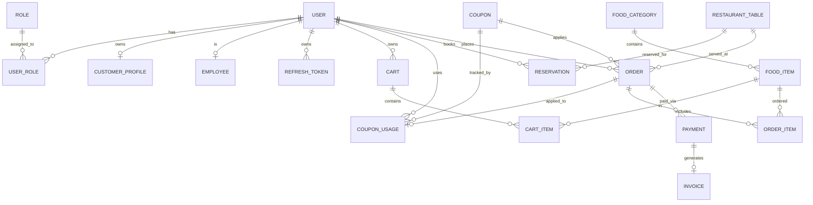

# Logical Database Design

## 1. Entity Inventory

| Entity | Primary Key | Business Purpose | Aggregate Root |
| ------ | ----------- | ---------------- | -------------- |
| User | id (BIGINT) | Tài khoản người dùng | Có |
| RefreshToken | id (BIGINT) | Phiên đăng nhập/Token refresh | Không (thuộc User) |
| Role | id (BIGINT) | Phân quyền hệ thống | Có |
| UserRole | (user_id, role_id) | Mapping bảng N-N | Không |
| CustomerProfile | id (BIGINT) | Hồ sơ khách hàng | Không (thuộc User) |
| Employee | id (BIGINT) | Hồ sơ nhân viên | Không (thuộc User) |
| FoodCategory | id (BIGINT) | Danh mục món ăn | Có |
| FoodItem | id (BIGINT) | Thông tin món ăn | Có |
| Cart | id (BIGINT) | Giỏ hàng tạm | Có |
| CartItem | id (BIGINT) | Món trong giỏ hàng | Không (thuộc Cart) |
| Coupon | id (BIGINT) | Mã giảm giá | Có |
| CouponUsage | id (BIGINT) | Lịch sử dùng mã | Không (thuộc Coupon) |
| RestaurantTable | id (BIGINT) | Bàn ăn | Có |
| Reservation | id (BIGINT) | Đặt bàn | Có |
| Order | id (BIGINT) | Đơn hàng tổng | Có |
| OrderItem | id (BIGINT) | Món trong đơn | Không (thuộc Order) |
| Payment | id (BIGINT) | Giao dịch thanh toán | Có |
| Invoice | id (BIGINT) | Hóa đơn tài chính | Có |

---

## 2. Relationship Matrix

| Entity A | Entity B | Relationship | Cardinality |
| -------- | -------- | ------------ | ----------- |
| User | RefreshToken | 1-N | 1:N |
| User | Role | M-N (via UserRole) | M:N |
| User | CustomerProfile | 1-1 | 1:1 |
| User | Employee | 1-1 | 1:1 |
| FoodCategory | FoodItem | 1-N | 1:N |
| User | Cart | 1-1 hoặc 1-N (Session) | 1:N |
| Cart | CartItem | 1-N | 1:N |
| FoodItem | CartItem | 1-N (Tham chiếu) | 1:N |
| Coupon | CouponUsage | 1-N | 1:N |
| User | CouponUsage | 1-N | 1:N |
| User | Reservation | 1-N | 1:N |
| RestaurantTable | Reservation | 1-N | 1:N |
| User | Order | 1-N | 1:N |
| RestaurantTable | Order | 1-N | 1:N |
| Coupon | Order | 1-N | 1:N |
| Order | OrderItem | 1-N | 1:N |
| FoodItem | OrderItem | 1-N (Tham chiếu) | 1:N |
| Order | Payment | 1-N | 1:N |
| Payment | Invoice | 1-1 | 1:1 |

---

## 3. Mermaid ERD

---

## 4. Business Constraint Catalog

#### RefreshToken
* Backend phải kiểm tra token không được hết hạn (`expires_at`) VÀ không bị thu hồi (`revoked_at` is null).
* Mã hash token (`token_hash`) phải là duy nhất.

#### Order
* Một Order phải có ít nhất 1 OrderItem.
* `sub_total`, `discount_amount`, `total_amount` >= 0.

#### Coupon
* `code` phải là duy nhất (UNIQUE).
* Số lượng `CouponUsage` sinh ra không được vượt quá `usage_limit`.
* `discount_value` phải >= 0 và `max_discount_amount` >= 0.

#### Reservation
* Hai Reservation có trạng thái `CONFIRMED` hoặc `SEATED` cho cùng 1 `table_id` không được giao nhau (overlap) về mặt thời gian.
* Sức chứa của bàn (`capacity`) >= số lượng khách (`guest_count`).

#### Payment
* `amount` >= 0.
* Một Order có thể có nhiều Payment (do fail) nhưng chỉ có 1 Payment thành công (PAID).

#### Invoice
* Một Payment (trạng thái PAID) chỉ phát hành tối đa 1 Invoice.

---

## 5. Enum Mapping

* `OrderStatus` -> `Order.order_status`
* `PaymentStatus` -> `Payment.payment_status`
* `CouponStatus` -> `Coupon.status`
* `ReservationStatus` -> `Reservation.status`
* `TableStatus` -> `RestaurantTable.status`

---

## 6. Audit Strategy

Mọi bảng chính đều có:
* `created_at` (DATETIME)
* `created_by` (BIGINT)
* `updated_at` (DATETIME)
* `updated_by` (BIGINT)
* `deleted_at` (DATETIME) - Để áp dụng Soft Delete
* `deleted_by` (BIGINT)
* `version` (INT) - Optimistic Locking

**Entity sử dụng Soft Delete:**
* User, CustomerProfile, Employee
* FoodCategory, FoodItem
* Coupon
* RestaurantTable

**Entity dùng Hard Delete:**
* Cart, CartItem (có thể xóa cứng khi checkout xong hoặc hết hạn session).
* Bảng trung gian UserRole.

**Đặc thù Logout & RefreshToken:**
* Khi logout sẽ không xoá bản ghi RefreshToken mà chỉ set giá trị `revoked_at` thành timestamp hiện tại.

**Entity Không được xóa (Kể cả Soft Delete):**
* Order, OrderItem, Payment, Invoice (Dữ liệu tài chính không được sửa/xoá sau khi đã chốt).

---

## 7. Cascade Rules

* `User` delete -> Soft delete. KHÔNG cascade xuống Order, Payment.
* **Xóa User không cascade hard delete RefreshToken** nếu cần giữ để lưu Audit (log truy cập cũ).
* `FoodCategory` delete -> Bị chặn (Restrict) nếu còn `FoodItem`.
* `FoodItem` delete -> Bị chặn (Restrict) nếu đang nằm trong `OrderItem`. (Nên dùng Soft delete để an toàn).
* `Order` delete -> Không cho phép xóa (Restrict).
* `Cart` delete -> Cascade delete các `CartItem`.
* `Payment` -> Restrict việc xóa `Invoice` tương ứng.

---

## 8. Index Strategy

Đề xuất Index trên các cột tìm kiếm thường xuyên:

* `idx_user_username`, `idx_user_email`: Tăng tốc độ đăng nhập và kiểm tra trùng lặp.
* `uk_refresh_token_hash`: Unique Index đảm bảo tính toàn vẹn của token phát hành.
* `idx_refresh_token_user`: Phục vụ query tất cả phiên đăng nhập của 1 user (logout all devices).
* `idx_refresh_token_expires_at`: Hỗ trợ batch job xoá các token đã hết hạn quá lâu.
* `idx_coupon_code`: Tăng tốc quá trình check mã giảm giá lúc order.
* `idx_reservation_time`: Tăng tốc độ query check trùng lặp thời gian đặt bàn.
* `idx_order_status`: Phục vụ load danh sách đơn hàng cho Staff và bếp nhanh.
* `idx_payment_status`: Phục vụ bộ lọc báo cáo doanh thu.

---

## 9. Database Naming Convention

Quy định chuẩn:
* `table_name`: snake_case, chữ thường, danh từ số nhiều (ví dụ: `users`, `food_items`, `orders`).
* `column_name`: snake_case, chữ thường (ví dụ: `first_name`, `created_at`).
* `foreign key`: `fk_[table]_[ref_table]` (ví dụ: `fk_order_user`).
* `unique key`: `uk_[table]_[column]` (ví dụ: `uk_user_email`).
* `index name`: `idx_[table]_[column]` (ví dụ: `idx_coupon_code`).

---

## 10. Risk Review

* **Duplicate payment risk**: Tránh bằng cách dùng Optimistic Locking (cột `version`) trên `Order`, check trạng thái Order trước khi thay đổi PaymentStatus thành PAID.
* **Double coupon usage risk**: Optimistic locking trên bảng `Coupon` (cập nhật cột đếm số lượt đã dùng).
* **Reservation conflict risk**: Với DB cơ bản, cần dùng khoá bi quan (`SELECT FOR UPDATE`) tại hàm xử lý đặt bàn để chống chèn 2 bản ghi giao nhau về thời gian cho 1 table_id.
* **Invoice duplication risk**: Áp dụng Unique Constraint `uk_invoice_payment_id` trên `payment_id` của bảng `Invoice` để đảm bảo 1 Payment có đúng 1 Invoice.
* **Lost update risk**: Sử dụng Optimistic Locking (`version`) bằng `@Version` JPA cho hầu hết các entity chính (Order, Payment, FoodItem...).

---

## 11. Entity Gap Analysis
Phân tích sự cần thiết của các Entity mở rộng:
* **RefreshToken**: ĐÃ ĐƯỢC CHỐT VÀ THÊM VÀO THIẾT KẾ. Thuộc User Domain. Quản lý chu kỳ sống của JWT (refresh/revoke token) để bảo mật tốt hơn.
* **AuditLog**: KHÔNG CẦN THIẾT. Thay vì tạo bảng riêng, ta sử dụng 4 trường audit chuẩn (`created_at`, `updated_at`, `created_by`, `updated_by`) để giữ hệ thống đơn giản theo phạm vi SWP391.
* **PaymentTransaction**: KHÔNG CẦN THIẾT. Có thể gộp vào `Payment`. Do `Payment` đã lưu trữ `transaction_code` và thông tin chi tiết thanh toán, hiện tại giữ `Payment` là đủ, không cần tách riêng bảng thứ hai.
* **Notification**: KHÔNG CẦN THIẾT lưu DB cứng. Các luồng push tới bếp/nhân viên có thể xử lý real-time qua WebSocket không cần lưu lịch sử DB để tránh phình to dữ liệu.
* **SystemSetting**: KHÔNG CẦN THIẾT. Các thiết lập nhỏ có thể lấy từ file config (`application.properties`) thay vì làm phức tạp DB.

---

## 12. Payment Review
Phân tích các kịch bản rủi ro thanh toán:
* **Trường hợp thanh toán thất bại**: Payment Entity chịu trách nhiệm. Payment sẽ có trạng thái `FAILED`. Order giữ nguyên trạng thái `PENDING_PAYMENT`.
* **Retry Payment**: User tạo một giao dịch Payment mới (ID mới) cho cùng một Order đó. Order -> Payment là 1:N.
* **Duplicate Callback**: Entity Payment chịu trách nhiệm. Cần ràng buộc `transaction_code` (Unique Key) và xử lý idempotency (nếu Payment đã `PAID` thì bỏ qua).
* **Payment Gateway Timeout**: Job quét định kỳ các Payment trạng thái `PENDING` quá timeout tự động chuyển thành `FAILED`.
* **User đóng trình duyệt giữa lúc thanh toán**: Dữ liệu Payment đã sinh (PENDING). Backend chờ webhook từ cổng thanh toán để cập nhật, không phụ thuộc vào frontend.
* **Thanh toán thành công nhưng Order chưa cập nhật**: Ràng buộc Transaction ở Service: Cập nhật PaymentStatus -> PAID và OrderStatus -> CONFIRMED trong cùng 1 Transaction (`@Transactional`).

---

## 13. Invoice Review
Phân tích luồng hoá đơn:
* **Một Order có tối đa bao nhiêu Invoice**: Tối đa 1 Invoice.
* **Invoice sinh lúc nào**: Tự động sinh ra KHI VÀ CHỈ KHI PaymentStatus chuyển sang `PAID` thành công.
* **Invoice có được regenerate không**: KHÔNG ĐƯỢC regenerate để đảm bảo tính pháp lý. Nếu có sai sót, phải cancel Order/Payment và tạo giao dịch mới (hoặc Refund).
* **Invoice có cần unique number không**: Cần có `invoice_number` duy nhất sinh tự động. DB cần ràng buộc Unique Key (`uk_invoice_number`).
* **Cách chống duplicate invoice**: Thêm Unique Constraint `uk_invoice_payment_id`. Đảm bảo 1 Payment có 1 Invoice duy nhất.

---

## 14. Coupon Review
Phân tích luồng giảm giá:
* **Global coupon**: Áp dụng chung, quản lý qua `usage_limit` tổng ở bảng `Coupon`.
* **Per-user coupon**: Cần kiểm tra bảng `CouponUsage` để đếm số lần sử dụng của một user cụ thể (chưa vượt quá max per user).
* **Usage limit**: Số lần tối đa mã được dùng trên toàn hệ thống.
* **Concurrent usage (Ví dụ 2 user dùng mã cuối cùng cùng lúc)**: Giải quyết bằng **Optimistic Locking** (`version` column trên bảng `Coupon`). Hai giao dịch cùng update sẽ làm tăng version, transaction thứ hai commit sẽ văng lỗi `OptimisticLockException`. Bắt lỗi và báo "Mã giảm giá đã hết".

---

## 15. Reservation Conflict Review
Phân tích luồng đặt bàn:
* **Trùng bàn**: Không cho phép 2 khách đặt cùng 1 `table_id` trong cùng khoảng thời gian phục vụ.
* **Trùng thời gian**: `reservation_time` không được giao nhau (overlap time).
* **Reservation hết hạn**: Reservation qua giờ mà khách không tới (status `CONFIRMED`) cần cronjob chuyển thành `CANCELLED`.
* **Walk-in customer**: Sẽ không tạo Reservation, tạo luôn Order, chuyển TableStatus sang `OCCUPIED`.
* **Giải pháp tầng DB/Service**: Không thể chỉ dùng Unique Constraint thông thường cho overlap. Validation Service sẽ query tìm các `Reservation` cùng `table_id` trong khoảng thời gian `[time - 2h, time + 2h]`. Cần bọc block code đó trong một lock bi quan (Pessimistic Write Lock) trên `RestaurantTable` hoặc dùng thư viện khoá phân tán nếu ứng dụng chạy nhiều node.

---

## 16. Kitchen Workflow Review
Phân tích luồng OrderStatus:
* **PENDING** -> **CONFIRMED**: Do Staff bấm xác nhận, hoặc Customer thanh toán xong (System tự nhảy).
* **CONFIRMED** -> **PREPARING**: Do **Kitchen** bấm nhận nấu.
* **PREPARING** -> **READY**: Do **Kitchen** bấm hoàn thành món.
* **READY** -> **COMPLETED**: Do **Staff** mang món ra bàn và xác nhận.
* **CANCELLED**: Do Staff hoặc Admin thao tác.
* **Trạng thái cần lưu lịch sử**: Tạm thời chưa tách bảng lịch sử. Lưu thông tin qua `updated_at` và `updated_by` để truy vết người thực hiện cuối cùng.

---

## 17. Concurrency Strategy
Chiến lược xử lý tương tranh:
* **Coupon race condition**: Áp dụng Optimistic Locking trên entity `Coupon`.
* **Reservation race condition**: Áp dụng Pessimistic Locking (`SELECT FOR UPDATE`) cho việc đọc bàn trống, hoặc khoá mức Table.
* **Payment race condition**: Áp dụng Optimistic Locking trên `Order` và `Payment`.
* **Lost update**: Giải quyết bằng cột `version` cho các bảng `Order`, `Payment`, `Coupon`, `FoodItem` (JPA `@Version`).
* **Unique Constraints**: Bắt buộc có ở DB cho `transaction_code`, `invoice_number`, `coupon_code` để đề phòng code lỗi.

---

## Final Recommendation Before Physical Design
Đề xuất chốt trước khi viết SQL:
* **Có cần thêm entity nào không**: ĐÃ THÊM `RefreshToken` vào thiết kế chính thức. Các entity khác giữ nguyên.
* **Có cần sửa Relationship Matrix không**: ĐÃ BỔ SUNG `User -> RefreshToken (1:N)`.
* **Có cần sửa Data Dictionary không**: ĐÃ BỔ SUNG `RefreshToken` vào schema từ vựng.
* **Có blocker nào trước DB-01C không**: KHÔNG CÓ BLOCKER. Hệ thống đã đồng bộ `RefreshToken` vào cả 3 tài liệu cơ sở. Thiết kế Logical đã đủ an toàn để chuyển hóa thành tập lệnh SQL thực tế (Physical Design).
